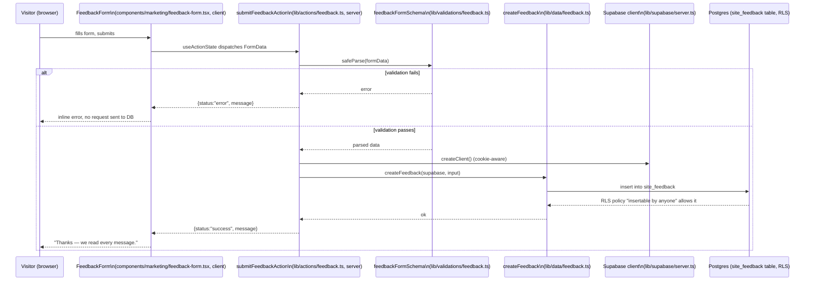
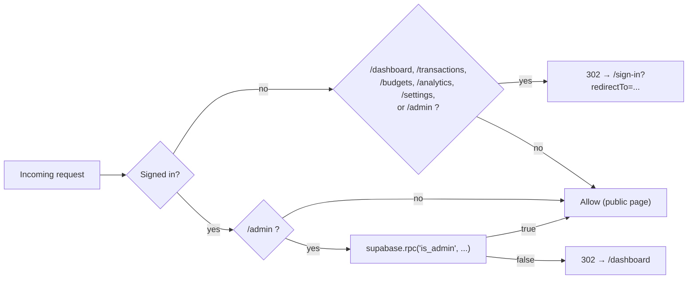

# Architecture, File Structure & Data Flow

This is the map: where code lives, why it's organized this way, and how a request actually moves
through the system. Read `CLAUDE.md` first for build history and status — this file explains the
*shape* of the codebase itself, so a new session (or a new contributor) can find things without
grepping blind.

## 1. Layering, in one picture

```mermaid
flowchart TB
    Browser["Browser"]
    subgraph Next["Next.js (App Router)"]
        MW["proxy.ts → lib/supabase/middleware.ts\n(session refresh, CSP nonce, route gates)"]
        Pages["app/**/page.tsx\n(Server Components — fetch on the server)"]
        Actions["lib/actions/*.ts\n(\"use server\" — validated mutations)"]
        Client["Client Components\n(components/**, \"use client\")"]
    end
    Domain["lib/finance/*\n(pure calculation functions, no I/O)"]
    Data["lib/data/*\n(typed Supabase queries — the ONLY place\nthat talks to the DB)"]
    Validation["lib/validations/*\n(Zod schemas)"]
    SupaClient["lib/supabase/{client,server}.ts"]
    DB[("Supabase Postgres\nRLS on every table")]
    Auth["Supabase Auth"]

    Browser -->|every request| MW
    MW -->|refreshes session, gates /dashboard.. and /admin| Pages
    Browser -->|form submit| Actions
    Pages --> Data
    Actions --> Validation
    Actions --> Data
    Pages --> Domain
    Data --> SupaClient
    SupaClient --> DB
    SupaClient --> Auth
    Pages -.renders.-> Client
    Client -.calls via form action.-> Actions
```

**The rule that makes this hold together:** components never call Supabase directly. Every read
goes through `lib/data/*`, every write is a Zod-validated `lib/actions/*` server action that also
calls into `lib/data/*`. This is `CLAUDE.md` §4 rule 3, and it's why `lib/data` functions all take
an already-constructed `SupabaseClient` as their first argument instead of creating their own —
callers (a Server Component, a server action, `e2e` setup code) each get the client appropriate to
their context, but the query logic itself is identical everywhere.

## 2. Directory map

```
app/                        Routes only. Every folder here is a URL segment (or a route group).
  (marketing)/               Public landing page. Route group → doesn't appear in the URL.
    page.tsx                 Composes components/marketing/* sections in order.
    layout.tsx                SiteHeader + SiteFooter shell.
  (auth)/                    Sign-in / sign-up / OAuth callback. Route group.
    sign-in/, sign-up/        Each a page.tsx + the matching components/auth/*-form.tsx.
    callback/route.ts         PKCE code exchange (GET route handler, not a page).
    layout.tsx                Shared centered-card auth shell.
  (app)/                     The authenticated product. Route group — URLs are /dashboard etc,
                              NOT /app/dashboard. Grouped only so they share one layout.
    layout.tsx                 Wraps children in components/layout/app-shell.tsx (top nav).
    dashboard/, transactions/, budgets/, analytics/, settings/
                                Each: page.tsx (Server Component, fetches via lib/data),
                                loading.tsx (skeleton), sometimes a route.ts (export CSV).
  admin/                     NOT a route group — a real segment, so its URL is /admin.
                              Deliberately separate from (app): different audience, different
                              shell (app/admin/layout.tsx), different gate (see §4).
  layout.tsx, error.tsx, not-found.tsx, globals.css
                              Root layout + the two App Router error boundaries.

components/                 All UI, grouped by the feature that owns it — NOT by route.
  marketing/                  Landing page sections (hero, pricing-style value props, etc).
                              Note: these live HERE, not under app/(marketing)/ — the app/
                              tree is routes only, see §2's rule above.
  auth/                       sign-in-form.tsx, sign-up-form.tsx (client components; the pages
                              that host them are Server Components).
  layout/                     app-shell.tsx — the authenticated-app chrome (nav, mobile menu).
  dashboard/, transactions/, budgets/, analytics/, settings/
                              One folder per (app) route, holding that page's client-side pieces
                              (forms, charts, filters) — the page.tsx itself stays server-only
                              and imports from here.
  shared/                     Small things used across more than one feature (category-icon.tsx).
  ui/                         Design-system primitives with zero domain knowledge: button, input,
                              label, dialog. If a component doesn't know what a "transaction" is,
                              it belongs here.

lib/
  finance/                    Pure functions — calculations.ts, date-range.ts. No Supabase import,
                              no fetch, nothing async unless the math itself needs it. This is
                              deliberate: it's the one directory you can unit-test with zero mocks,
                              which is why tests/unit/ mirrors it 1:1.
  data/                       The ONLY code allowed to call `supabase.from(...)`. One file per
                              table-ish concern (accounts.ts, transactions.ts, budgets.ts,
                              categories.ts, profile.ts, feedback.ts, admin.ts) plus dashboard.ts
                              for the one cross-table read the dashboard needs. Every exported
                              function takes `(supabase, ...args)` — see §1.
  actions/                    "use server" mutations, one file per feature, each function paired
                              1:1 with a `lib/validations/*` schema. These are what
                              `<form action={...}>` or `useActionState` point at from a client
                              component — see §3 for the full request shape.
  validations/                Zod schemas. Naming mirrors actions/ (transaction.ts validates what
                              transactions.ts actions accept), not data/ or components/.
  supabase/                   client.ts (browser client), server.ts (Server Component/Action
                              client, cookie-aware), middleware.ts (used by proxy.ts — session
                              refresh, CSP nonce, route gating; see §4).
  formatters/                  currency.ts — display formatting, kept out of finance/ because it's
                              presentation, not calculation (a formatted string is never fed back
                              into a calculation).
  utils.ts                    `cn()` (clsx + tailwind-merge) — the one truly generic helper.

types/database.ts           Hand-maintained (NOT `supabase gen types` output — see the warning at
                              the top of the file). Row/Insert/Update types per table, plus the
                              `Database` type every Supabase client is parameterized with.

supabase/
  migrations/                  Numbered, sequential, never edited after landing (0001_init.sql,
                              0002_default_categories.sql, 0003_admin.sql, 0004_site_feedback.sql).
                              Every schema change is a new file — CLAUDE.md §4 rule 8.
  seed.sql                     Local-only synthetic demo data (1 account / 1 transaction / 1
                              budget) for a placeholder user id you swap after signing up. Never
                              auto-applied to a real signup.
  config.toml                  Local Supabase stack config (ports, auth settings, etc).

public/images/               Self-hosted photos only — see docs/image-sources.md for the sourcing
                              rules. credits.json is the license/attribution ledger; every file
                              here must have an entry.

e2e/, tests/unit/, tests/integration/
                              Playwright end-to-end, Vitest unit (mirrors lib/finance/), and an
                              intentionally-empty placeholder for future integration tests.

.claude/skills/run-clearledger/
                              The agent-facing "how to run and drive this app" skill — see its
                              own SKILL.md. Not application code.

docs/01–05*.md, MASTER-PLAN.md, TASKS.md, HANDOFF.md, CLAUDE.md, ARCHITECTURE.md (this file)
                              Planning/reference docs. CLAUDE.md is the entry point; it tells you
                              which of the others to read and when.
```

**Two dead directories were removed while writing this doc**: `app/(marketing)/components/` (empty
— the real location is `components/marketing/`, per the rule in §2; `CLAUDE.md` previously pointed
at the wrong path and has been corrected) and `lib/constants/` (empty, unused). If you see either
referenced anywhere else, it's stale.

## 3. Data flow: a mutation end to end

Concrete example — submitting the marketing site's feedback form — because it touches every layer:



Every other mutation in the app (add a transaction, set a budget, archive an account) follows this
exact shape: client component → server action → Zod → `lib/data` → Supabase client → Postgres RLS.
The only thing that changes per-feature is which table and which policy. **This is why there's no
try/catch-and-hope in the UI layer** — the failure modes are enumerated at each stage (bad input →
Zod catches it before any network call; unauthorized → RLS returns nothing/errors, the action
turns that into a generic user-facing message) rather than trusted to bubble up correctly.

## 4. Auth, sessions, and the two kinds of route gate

`proxy.ts` (Next 16's renamed `middleware.ts` — see `CLAUDE.md` §8) delegates to
`lib/supabase/middleware.ts` on every request matched by its `config.matcher`. That function does
three unrelated jobs in one pass, because Next only gives you one middleware hook per request:

1. **Refreshes the Supabase session** (rotates the auth cookie if the access token is stale) —
   this has to happen on every request, not just protected ones, or a long-idle tab's session
   silently expires.
2. **Builds the per-request CSP nonce** and sets it as both a request header and a response
   header. **This alone is not enough** — `app/layout.tsx` must also call `headers()` (it does,
   deliberately, with a comment explaining why) so Next actually reads the nonce back and applies
   it to its own injected script tags, *and* so the route is forced into dynamic (per-request)
   rendering. Skip that and a statically-prerendered page's nonce gets baked in at build time,
   permanently mismatching the fresh nonce this middleware generates on every real request —
   which silently breaks **every script on the page**, including Next's own framework chunks, with
   zero visible symptom in `next dev` (only a real `next build && next start` reproduces it). This
   happened for real in this project — see `TASKS.md`'s Phase 16 entry for how it was caught.
3. **Gates two different kinds of route**, and this is the part worth being precise about:



**The admin gate is intentionally checked on every request, not cached in the session/JWT.**
Demoting an admin (deleting their `admin_users` row) takes effect on their very next navigation,
not on their next login. The cost is one extra Postgres round trip per `/admin` request — judged
worth it for a route this sensitive.

**The middleware redirect is a UX convenience, not the security boundary.** The real boundary is
Postgres RLS: `admin_users` and `site_feedback` both have `select` policies gated by the same
`is_admin(auth.uid())` function the middleware calls. A non-admin hitting the REST API directly
(bypassing the Next.js app entirely) gets an empty result set, not just a redirect — verified
directly against the local stack with a real non-admin JWT during the admin feature's build (see
`TASKS.md`).

## 5. Database shape

```mermaid
erDiagram
    profiles ||--o{ accounts : owns
    profiles ||--o{ transactions : owns
    profiles ||--o{ budgets : owns
    profiles ||--o{ categories : "owns (or null = system)"
    profiles ||--o| admin_users : "may be"
    profiles ||--o{ site_feedback : "may have submitted"
    accounts ||--o{ transactions : "posted against"
    categories ||--o{ transactions : categorizes
    categories ||--o{ budgets : "budgeted for"

    profiles {
        uuid id PK
        text display_name
        char3 currency
        text timezone
    }
    accounts {
        uuid id PK
        uuid user_id FK
        text name
        text type
        numeric opening_balance
        bool is_archived
    }
    categories {
        uuid id PK
        uuid user_id FK "null = system default"
        text name
        text kind "expense | income"
    }
    transactions {
        uuid id PK
        uuid user_id FK
        uuid account_id FK
        uuid category_id FK
        text type "expense | income | transfer"
        numeric amount
        text note
        timestamptz occurred_at
    }
    budgets {
        uuid id PK
        uuid user_id FK
        uuid category_id FK
        date month_start
        numeric amount
    }
    admin_users {
        uuid user_id PK_FK
        uuid granted_by FK
    }
    site_feedback {
        uuid id PK
        uuid user_id FK "nullable — visitor may be anonymous"
        text name
        text message
    }
```

Every user-owned table has RLS `using (auth.uid() = user_id)` (`CLAUDE.md` §4 rule 6) — the one
deliberate exception is `categories`, where `user_id is null` means "system default, readable by
everyone" (see the migration comment in `0001_init.sql`). `admin_users` and `site_feedback` don't
follow the ownership pattern at all: `admin_users` is admin-readable only (nobody can read their
own row directly — the app checks via the `is_admin()` function instead), and `site_feedback` is
insert-open / admin-read-only, since it's a one-way visitor mailbox, not user-owned data.

Money is always `numeric(14,2)` in Postgres and a JS `number` at rest in app code — never a float
persisted, per `CLAUDE.md` §4 rule 5. Arithmetic on money lives exclusively in `lib/finance/`.

## 6. Where a new feature's pieces go

Use this as the checklist when adding anything that touches the database:

1. `supabase/migrations/000N_whatever.sql` — schema + RLS policies, following an existing
   migration's style (see `0003_admin.sql` for a security-definer-function pattern, `0001_init.sql`
   for a plain owned table).
2. `types/database.ts` — hand-add the Row/Insert/Update type for the new table (do **not** run
   `supabase gen types` over this file — it replaces the hand-maintained aliases every other file
   imports with an auto-generated shape that breaks the build; if you need generated types, write
   them to a scratch file and port the pieces over by hand).
3. `lib/data/<feature>.ts` — typed query functions, `(supabase, ...) => ...` signature.
4. `lib/validations/<feature>.ts` — Zod schema for anything user-submitted.
5. `lib/actions/<feature>.ts` — `"use server"` functions pairing 3+4, one per mutation.
6. `components/<feature>/*.tsx` — the UI; a form component calls the action via
   `useActionState`/`<form action>`, per §3's flow.
7. `app/<route>/page.tsx` — Server Component wiring it together, reading via `lib/data` directly
   (pages don't go through actions for reads — actions are for mutations only).

If the feature needs its own top-level URL, decide route group vs. real segment the way `(app)`
vs. `admin` did: route group when it should share an existing shell and blend into that URL space,
a real segment when it needs its own shell/audience/gate.
