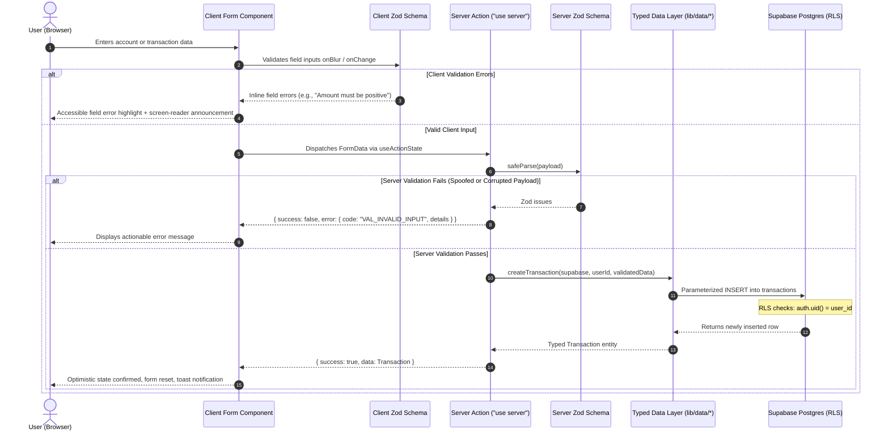

# Data Flow, Dual-Tier Validation & Financial Integrity

> LedgerIT Engineering Specification  
> Lead Data Architect & Senior Data Flow Specialist

---

## 1. End-to-End Data Lifecycle

Data in LedgerIT moves across deterministic boundaries with strict contract validation at every step.



---

## 2. Dual-Tier Validation Architecture

### Tier 1: Client-Side Ergonomics
- **Library**: `react-hook-form` paired with `@hookform/resolvers/zod`.
- **Purpose**: Immediate, zero-latency feedback as users fill forms. Highlights inputs with `aria-invalid="true"` and associates error IDs using `aria-describedby`.
- **Guarantee**: Prevents unnecessary network requests when user input violates basic format constraints.

### Tier 2: Server-Side Ground Truth
- **Library**: `zod` schemas located in `lib/validations/*`.
- **Purpose**: Authoritative security gate executed within Server Actions on the server.
- **Guarantee**: Even if a request is constructed via `curl`, headless scripts, or intercepted HTTP requests, the server validates:
  - Exact data types (strings, positive numbers, valid ISO-8601 timestamps).
  - Bounds (e.g. amounts between 0.01 and 999,999,999.99).
  - Strip unknown fields via strict object parsing to prevent mass-assignment attacks.

---

## 3. Financial Integrity & Zero-Float-Drift Rule

In financial software, standard IEEE 754 floating-point numbers produce rounding drift:
```javascript
// The classic floating-point bug:
0.1 + 0.2 === 0.30000000000000004 // true
```

### LedgerIT Architectural Guarantees:
1. **Database Level**: All currency amounts are stored in PostgreSQL as `numeric(14,2)`. Floats or real types are strictly forbidden.
2. **Domain Layer (`lib/finance/`)**:
   - All arithmetic operations (sums, percentages, balances, runway calculations) reside exclusively in pure functions inside `lib/finance/calculations.ts`.
   - Money values are manipulated using exact decimal scaling (converting to integer cents during intermediate operations or using fixed-point math).
3. **Presentation Layer (`lib/formatters/currency.ts`)**:
   - Standardized formatting using `Intl.NumberFormat` with specified locale and currency. Formatted strings are never converted back into numeric calculations.

---

## 4. Zero Fake Data Policy

LedgerIT enforces an authentic data invariant across all environments:
1. **Clean Empty States**: When a user registers, their dashboard, transactions, and budgets display curated, welcoming empty states with guided calls-to-action ("Add your first bank account", "Set a monthly budget").
2. **No Hardcoded Mock Rows in Production**: Production routes never inject dummy or synthetic data into real user sessions.
3. **Isolated Local Seed Data**: Local synthetic testing data is strictly confined to `supabase/seed.sql` for offline local development and is never applied to live user databases.

---

## 5. Standardized Error Response Envelope

All server mutations return a standardized, type-safe envelope defined in `lib/errors/codes.ts`:

```typescript
export type ActionResponse<T = unknown> =
  | { success: true; data: T; error?: never }
  | { 
      success: false; 
      data?: never; 
      error: { 
        code: ErrorCode; 
        message: string; 
        fieldErrors?: Record<string, string[]>;
      } 
    };
```
This guarantees uniform client error handling without runtime type checking or unexpected `null` crashes.
