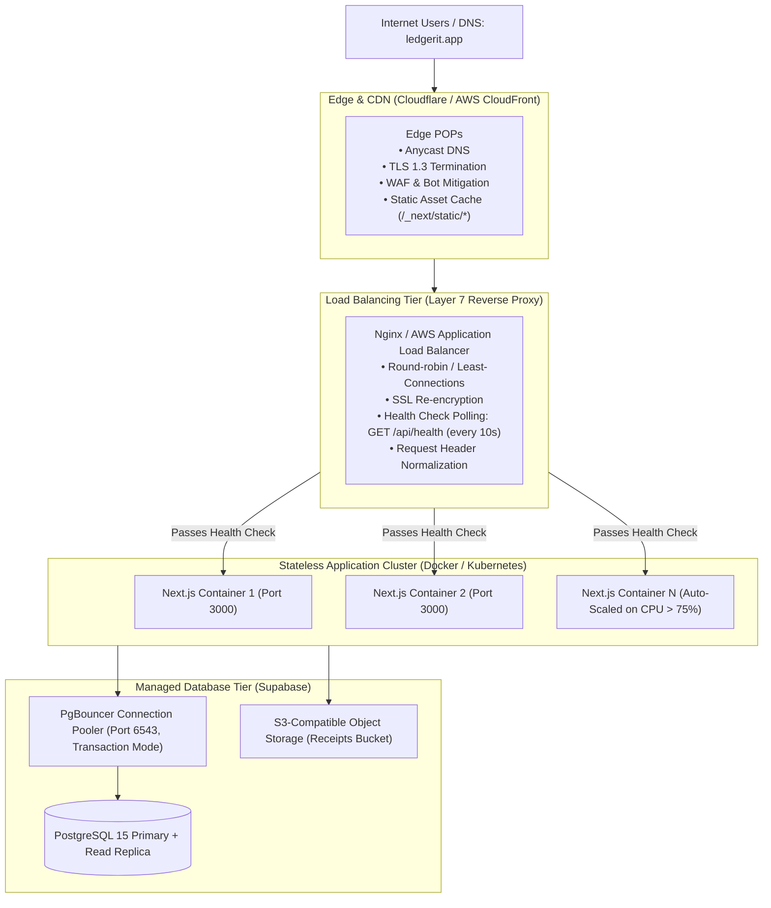

# Deployment, Load Balancing & Infrastructure Architecture

> LedgerIT Production Engineering Specification  
> Lead Systems Architect & Infrastructure Specialist

---

## 1. High-Availability Production Topology



---

## 2. Load Balancer Configuration (Nginx Reference)

Below is the verified Layer 7 reverse proxy configuration for load-balanced deployments:

```nginx
upstream nextjs_upstream {
    least_conn;
    server app-node-1:3000 max_fails=3 fail_timeout=10s;
    server app-node-2:3000 max_fails=3 fail_timeout=10s;
    server app-node-3:3000 max_fails=3 fail_timeout=10s;
    keepalive 32;
}

server {
    listen 80;
    server_name ledgerit.app www.ledgerit.app;
    return 301 https://$host$request_uri;
}

server {
    listen 443 ssl http2;
    server_name ledgerit.app www.ledgerit.app;

    ssl_certificate /etc/ssl/certs/ledgerit.crt;
    ssl_certificate_key /etc/ssl/private/ledgerit.key;
    ssl_protocols TLSv1.2 TLSv1.3;
    ssl_ciphers HIGH:!aNULL:!MD5;

    # Static Next.js assets caching
    location /_next/static/ {
        proxy_pass http://nextjs_upstream;
        proxy_cache_valid 200 365d;
        add_header Cache-Control "public, max-age=31536000, immutable";
    }

    # Health check endpoint for upstream monitoring
    location /api/health {
        proxy_pass http://nextjs_upstream;
        access_log off;
        proxy_connect_timeout 2s;
        proxy_read_timeout 2s;
    }

    # Dynamic Next.js SSR & Server Actions
    location / {
        proxy_pass http://nextjs_upstream;
        proxy_http_version 1.1;
        proxy_set_header Upgrade $http_upgrade;
        proxy_set_header Connection 'upgrade';
        proxy_set_header Host $host;
        proxy_set_header X-Real-IP $remote_addr;
        proxy_set_header X-Forwarded-For $proxy_add_x_forwarded_for;
        proxy_set_header X-Forwarded-Proto $scheme;
        proxy_set_header X-Request-Id $request_id;
    }
}
```

---

## 3. Database Connection Pooling (PgBouncer)

In serverless or horizontally scaled container clusters, uncontrolled direct connections can overwhelm PostgreSQL connection limits (causing `FATAL: remaining connection slots are reserved`).

### Rules:
1. **Transaction Pooling (Port 6543)**: Always configure `NEXT_PUBLIC_SUPABASE_URL` or database connection strings to route through PgBouncer in **transaction mode**.
2. **Prepared Statements**: Disable client-side prepared statement caching when using transaction mode to avoid cross-transaction state pollution.
3. **Session Refresh**: Supabase Auth sessions are stateless JWTs validated locally or via token introspection. No persistent database connection is held open during user browsing.

---

## 4. Environment Variables Checklist

| Variable | Scope | Description |
| :--- | :--- | :--- |
| `NEXT_PUBLIC_SUPABASE_URL` | Public (Client + Server) | Base URL of the Supabase project / local gateway |
| `NEXT_PUBLIC_SUPABASE_PUBLISHABLE_KEY` | Public (Client + Server) | PostgREST / GoTrue public publishable API key |
| `NEXT_PUBLIC_APP_URL` | Public (Client + Server) | Canonical application domain (e.g. `https://ledgerit.app`) |
| `SUPABASE_SERVICE_ROLE_KEY` | **Server-Only (Secret)** | Elevated administrative key (never committed to git) |
| `NODE_ENV` | System | Set to `production` in live container environments |

---

## 5. Database Migration Protocol

Migrations reside in `supabase/migrations/` and are strictly numbered and immutable:
- `0001_init.sql`: Core tables, profiles, accounts, transactions, budgets, categories + RLS policies
- `0002_default_categories.sql`: Seed data for system default categories
- `0003_admin.sql`: Administrative RBAC table and `is_admin()` security-definer function
- `0004_site_feedback.sql`: Public feedback table + admin read policy

### Running Migrations:
```bash
# Local development
npx supabase db reset

# Remote production deployment
npx supabase db push
```
Never modify landed migration files. Schema modifications must be applied as a new numbered file (e.g., `0005_*.sql`).
