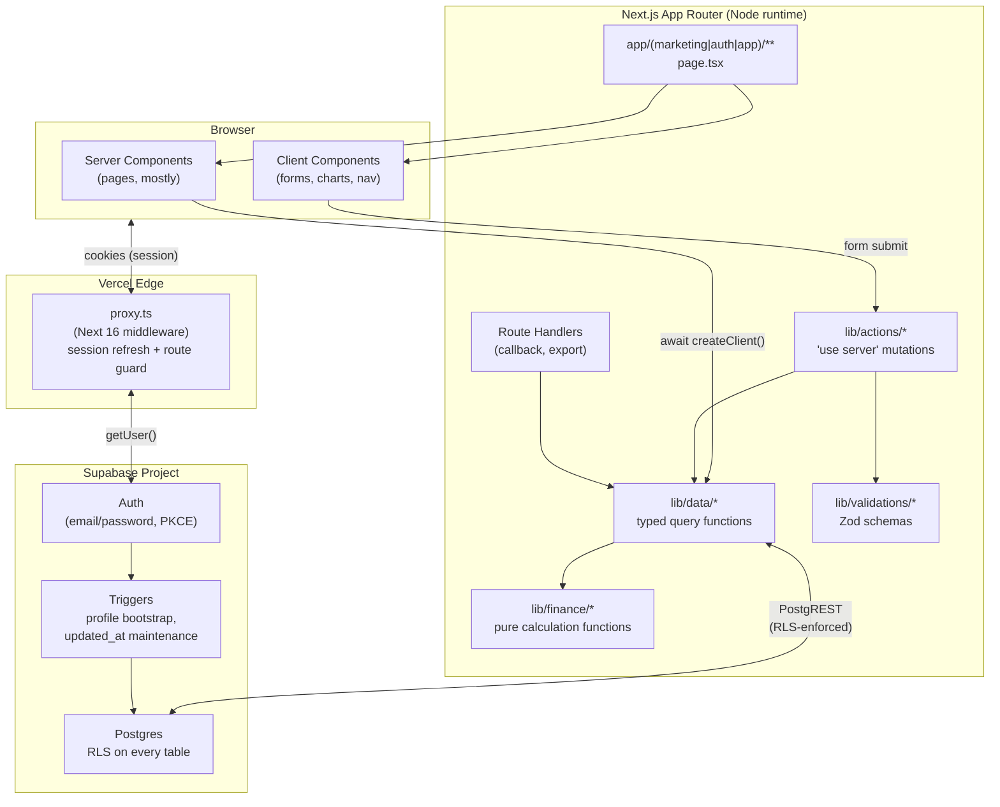
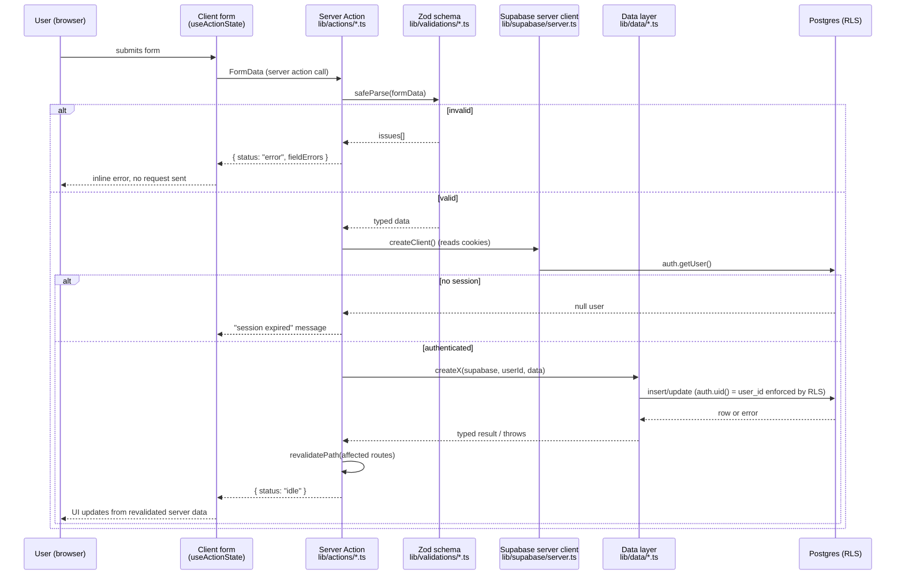
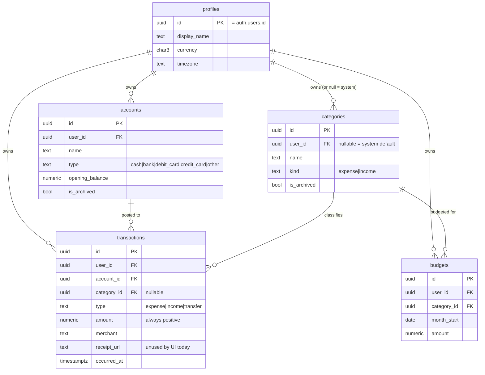

# Master Plan — Architecture, Data Flow & Launch Readiness

> Senior-engineer pass over the whole repository: architecture review, data-flow audit, gap analysis
> against `docs/01-05`, and a prioritized roadmap to take this from "all ten build phases done in a
> local dev environment" to "deployed, real users, defensible under load and under attack."
>
> This document does not replace `docs/01-05` or `CLAUDE.md` — it sits on top of them. `CLAUDE.md`
> tracks *what shipped*; this file tracks *what's left before this is a production product* and *why*.
> Update it as items close out, the same way `CLAUDE.md` §3 is kept current.

**Written:** 2026-09-14 · **Author:** Claude, continuing the multi-session build in `CLAUDE.md` ·
**Status at time of writing:** all 10 build phases functionally complete, verified against a local
Supabase instance, zero hosted infrastructure, no git repository, no CI.

---

## 1. Executive summary

The application is real, not a prototype: typed Supabase access, RLS on every table, server actions
for every mutation, Zod validation at every boundary, 14 passing unit tests, a passing Playwright
e2e suite, and a build that typechecks and lints clean. That's a solid engineering foundation most
side projects never reach.

What's missing is everything *outside* the application code that turns "works on my machine" into
"a product other people can sign up for": hosted infrastructure, a deploy pipeline, version control,
monitoring, and a handful of MVP features the product docs specify but the build skipped (password
reset, magic link, receipt upload). None of that is a rewrite — it's additive work layered on a
codebase that's already structured to take it cleanly (the data-access/actions/validations split
means most of this is new files, not surgery on old ones).

Two concrete, low-risk items from the original request were fixed directly rather than merely
planned — see §2.

## 2. Fixed already

- **Mismatched marketing images replaced.** `sunlit-desk-workspace-flatlay.jpg` (a generic
  Apple-hardware desk flatlay — an iMac, iPad, and Magic Mouse, nothing about budgeting) and
  `hands-reviewing-paper-receipts.jpg` (its alt text claimed "paper receipts" but the photo actually
  showed a MacBook Air and a UX wireframe sketchbook — it never depicted receipts at all) are gone.
  Replaced with `calculator-and-budget-worksheet.jpg` (a calculator on a handwritten budget
  worksheet with monthly totals circled) and `stack-of-shopping-receipts.jpg` (an actual stack of
  paper receipts) — both CC0 1.0 (public domain, no attribution legally required), sourced via
  Openverse from Rawpixel's public-domain collection, self-hosted under `public/images/`, logged in
  `public/images/credits.json` with source/license/download date per the schema in
  `docs/image-sources.md`. The third existing image (`coffee-and-receipts-on-counter.jpg`, final CTA
  background) was already accurate and is unchanged.
- **Literal "AI" mention removed from shipped copy.** `components/marketing/feature-highlights.tsx`
  said "no AI advice column" as a differentiator. Changed to "no gimmicks" — same point (this product
  doesn't do algorithmic financial advice), without naming a technology the product doesn't have and
  doesn't need to invoke either way.
- Verified after both changes: `tsc --noEmit`, `eslint`, `vitest run` (14/14), and `next build` all
  pass clean; confirmed via a live dev-server fetch that the landing page serves the three real image
  paths and visually confirmed via a full-page screenshot that both replacement photos render
  correctly in their sections.

Internal-only "AI" references were deliberately left alone: `docs/05-ai-build-prompt.md` (a
meta-document about prompting an AI coding assistant to build this repo — process documentation, not
product copy, never shipped to a user) and the "AI financial advice" line in `docs/01`'s non-goals
list (that line is *stating the product intentionally excludes AI-driven advice* — removing it would
undo a scoping decision, not remove an AI reference). Flagged here in case the intent was broader than
"nothing in the shipped UI mentions AI."

## 3. Architecture overview

### 3.1 System diagram



### 3.2 Mutation data flow (the one that matters most)

Every write in the app follows this exact path — it's the pattern `docs/02 §8` mandates and the
codebase actually implements it consistently (verified by reading every file under `lib/actions/`):



The important property this diagram makes visible: **authorization is checked twice, independently**
— once in the action (`user` must exist) and again by Postgres RLS (`auth.uid() = user_id`). A bug in
the action layer that forgot the `user` check would still not leak data across accounts, because the
database itself refuses the write. That's the correct way to build this, and it's already how the
code is written — nothing to fix here, just worth stating so a future contributor doesn't "simplify"
one of the two checks away.

### 3.3 Data model



One design note worth flagging explicitly rather than leaving implicit: **account balances shown in
the UI are the `opening_balance` column, not a computed running balance.** There is no data-layer
function that sums transactions against an account's opening balance to produce a live balance. If a
user expects "Bank — $2,340" to reflect their actual current balance after transactions, it currently
won't. This was called out in the last session's `HANDOFF.md` and is repeated here because it's the
single most likely "wait, why is this wrong" bug report a real user would file. See §6, Tier 2.

## 4. Repository audit

A layer-by-layer read of everything under `app/`, `components/`, `lib/`, `supabase/`, `tests/`,
`e2e/`. Grades are relative to "production SaaS," not "portfolio project" — this codebase clears the
portfolio bar comfortably already.

| Layer | What's there | Quality | Notable gaps |
|---|---|---|---|
| **Routing** | `app/(marketing)`, `app/(auth)`, `app/(app)` route groups; 10 routes total | Clean separation, correct use of route groups (no URL leakage) | No `sitemap.ts` / `robots.ts`; no `loading.tsx` for `(auth)` routes (has them everywhere in `(app)`) |
| **Auth** | Email/password sign-up + sign-in, PKCE callback, session-aware `proxy.ts` middleware, sign-out server action | Cookie handling correct (getAll/setAll pattern per Supabase SSR docs), redirect-back-to-origin (`redirectTo` param) works | No password reset, no magic link — both listed as MVP scope in `docs/01 §3` |
| **Data access (`lib/data`)** | One file per table, every function takes an explicit `SupabaseClient<Database>` + `userId`, thin wrappers with `if (error) throw` | Consistent, typed, no ad hoc queries found anywhere outside this layer (verified by grep — zero `.from(` calls outside `lib/data`) | No pagination on `listCategories` (fine at current scale — categories are bounded, ~11 system + a handful of user-created); `listTransactionsInRange` has no upper bound (used by dashboard/analytics/budgets — a user with 50k transactions in one month would pull all of them into memory for `calculateCategorySpend` etc.) |
| **Domain (`lib/finance`)** | `calculateNetChange`, `calculateCategorySpend`, `calculateBudgetProgress`, `calculateDailyTrend`, `calculateTopMerchants`, `buildDateRange`, `calculatePreviousPeriod` — all pure functions, all unit-tested | Textbook: no I/O, no framework imports, easy to test and reuse | None found. This is the strongest layer in the codebase. |
| **Server actions (`lib/actions`)** | One file per feature (`transactions`, `budgets`, `accounts`, `profile`, `auth`), every mutating action re-parses with Zod and re-checks `auth.getUser()` | Matches `docs/02 §8`'s mandated flow exactly (see §3.2 above) | `updateTransactionAction`/`deleteTransactionAction`/`archiveAccountAction`/`deleteBudgetAction` don't re-verify the row's `user_id` before mutating — they rely entirely on RLS to reject a spoofed id. That's *correct* (RLS is the real boundary) but means a stray `service_role` key anywhere in this code path would silently bypass ownership checks. Worth a comment at minimum; see §6 Tier 1. |
| **Validation (`lib/validations`)** | Zod schema per form, paired 1:1 with an action | Good; matches non-negotiable rule #4 | None found |
| **Supabase clients** | `client.ts` (browser), `server.ts` (RSC/actions, cookie-based), `middleware.ts` (proxy helper, has a no-env-vars early return for clean checkouts) | Correct three-client split for App Router | None found |
| **UI primitives (`components/ui`)** | `button`, `input`, `label`, `dialog` (focus trap + scroll lock + focus restore, added in Phase 10) | Solid; dialog accessibility was specifically hardened last session | No `select`/`combobox` primitive — filters and forms currently use native `<select>` styled ad hoc; fine for now, worth centralizing if more forms are added |
| **Charts** | Recharts, category spend bar chart + daily trend line, validated against the dataviz skill's palette checker | Good — accessible chart summaries not yet added (`docs/03 §15` calls for them explicitly: "Accessible chart summaries") | Charts have no `aria-label`/visually-hidden data table fallback — a screen reader user gets nothing from the chart region today |
| **Marketing (`components/marketing`)** | Hero, autoplay carousel (`motion/react`, keyboard + swipe + reduced-motion respecting), value props, how-it-works, feature highlights, final CTA, header/footer | High craft — carousel accessibility (role, aria-roledescription, live region, pause-on-hover, arrow keys) is genuinely above the median AI-built landing page | Images fixed (§2). No `og:image` — social shares of the marketing page render with no preview image. |
| **Testing — unit** | 14 tests across `calculations.test.ts` + `date-range.test.ts`, `vitest` + `jsdom` | Good coverage of the domain layer specifically | Zero tests for `lib/validations/*` (Zod schemas are exactly the kind of thing worth a table-driven test) and zero for `lib/formatters/currency.ts` |
| **Testing — integration** | `vitest.config.ts` already points at `tests/integration/**` | — | **The directory doesn't exist.** This is a real gap against `docs/02 §13`'s testing matrix, which explicitly calls for integration coverage of "data access functions" and "authenticated mutation behavior." |
| **Testing — e2e** | `e2e/app-flow.spec.ts`, one long happy-path spec, runs on `chromium` + `mobile` Playwright projects against a live Supabase instance | Real, not mocked — signs up actual users, randomized emails to avoid collisions | Single spec file, happy path only. No coverage for: invalid login, RLS-denied cross-user access from the browser (only checked via raw REST in Phase 10, never through the UI), budget edit/delete, account archive, CSV export content correctness. |
| **Database** | 2 migrations, RLS on every table, `check` constraints on money/enums, 5 indexes matching `docs/02`'s recommended list exactly, 2 triggers (`updated_at`, profile bootstrap) | Excellent — this is the part of the build that most reads like it was written by someone who has been burned by a missing index before | No migration exists yet for a Supabase Storage bucket (receipts) — needed before `receipt_url` can ever be populated |
| **Config / infra** | `.env.example`, `next.config.ts` (empty — no image domains, no headers, no redirects configured), `tsconfig.json`, `eslint.config.mjs` | Baseline only | No `next.config.ts` security headers, no CSP, no `sitemap.ts`/`robots.ts`, no CI workflow file anywhere in the repo, no `.nvmrc`/`engines` field pinning the Node version this was built against (24.x) |
| **Version control** | None — `git init` was never run | — | Everything above is sitting on a filesystem with no history, no branches, no way to `git blame` a regression, and no way to open a PR. This is the single highest-leverage thing to fix before anything else in this document. |

## 5. Gap analysis against `docs/01` MVP scope

Reading `docs/01-product-requirements.md §3` line by line against what's built:

| Requirement | Status |
|---|---|
| Sign up / sign in / sign out | ✅ Built |
| Password reset | ❌ Not built (docs mark this required, not optional) |
| Magic-link sign-in | ⚠️ Docs mark this optional — not built |
| Protected routes | ✅ `proxy.ts` redirects unauthenticated users, preserves `redirectTo` |
| Accounts: create, type, currency, masked last-four, archive | ✅ Built |
| Transactions: amount/type/category/account/merchant/note/date | ✅ Built |
| Transaction: optional receipt image | ❌ Column exists (`receipt_url`), no upload UI, no Storage bucket |
| Transaction file validation (type/size) | ❌ N/A until upload exists |
| Categories: seeded defaults, rename/create/archive/icon | ⚠️ Seeded defaults ✅ (`0002_default_categories.sql`); user rename/create/archive from the UI — **not built**. Categories are read-only from the app's perspective today (`lib/data/categories.ts` only exports `listCategories`). |
| Dashboard: all 10 listed metrics/filters | ✅ Built (spend, income, net change, budget progress *is on the Budgets page, not the dashboard itself* — minor scope note, not a bug, since `docs/01` groups it under Dashboard but the actual UX puts budget progress on its own page, which is arguably better IA) |
| Budgets: monthly, progress, remaining, over-budget, month nav | ✅ Built |
| Analytics: category/time/income-vs-expense/top-merchants/period comparison | ✅ Built |
| Export: CSV, respects filters, no raw IDs exposed | ✅ Built — verified by reading the route handler, it resolves both `account_id` and `category_id` to names before writing rows |
| Home page hero/carousel/sections | ✅ Built |
| Loading/empty/error/success/disabled states everywhere | ✅ Present on every data view checked |
| Responsive 320px+ | ✅ Verified via Playwright at 1440px and 390px in earlier sessions |

**Net:** three real product gaps remain — password reset, receipt upload, and user-facing category
management. Everything else in the MVP scope is done.

## 6. Roadmap to production, in priority order

Organized in tiers. Do them roughly in order — later tiers assume earlier ones are done (e.g., you
want CI running before you're merging security-header changes via PRs).

### Tier 0 — Blocked on you, not on engineering work

These need accounts/decisions only you can make. Nothing below this tier can go to real users
without them:

1. **Create a git repository.** `git init`, initial commit, push to GitHub/GitLab. Everything from
   CI to Vercel's git-based deploys to code review depends on this existing. This should happen
   *before* the next item, so the hosted-Supabase migration history has a commit trail.
2. **Create a hosted Supabase project** (the free tier is enough to start). Run both migrations
   (`0001_init.sql`, `0002_default_categories.sql`) against it, decide whether to also run
   `supabase/seed.sql` (demo data — probably *not* on the real project). Swap `.env.local` /
   Vercel env vars to the hosted project's URL + publishable key.
3. **Create a Vercel project** connected to the git repo, set the same env vars there
   (`NEXT_PUBLIC_SUPABASE_URL`, `NEXT_PUBLIC_SUPABASE_PUBLISHABLE_KEY`, `NEXT_PUBLIC_APP_URL` set to
   the real production domain — this matters, it's used for `metadataBase` and OG tags).
4. **Decide on a domain** (or accept the `*.vercel.app` default) — needed to finalize
   `NEXT_PUBLIC_APP_URL` and the Supabase Auth redirect allow-list.
5. **Add the Supabase Auth redirect URL** for the production domain in the Supabase dashboard
   (Authentication → URL Configuration) — sign-up/sign-in will silently fail to redirect correctly
   without this.

### Tier 1 — Security hardening (do before any real user signs up)

1. **Security headers.** `next.config.ts` currently sets none. Add at minimum:
   `Strict-Transport-Security`, `X-Content-Type-Options: nosniff`, `X-Frame-Options: DENY` (or a CSP
   `frame-ancestors 'none'`), `Referrer-Policy: strict-origin-when-cross-origin`, and a basic
   Content-Security-Policy scoped to Supabase's domain + `'self'`. This is a `headers()` export in
   `next.config.ts` — no new files needed.
2. **Rate limiting on auth routes.** Sign-in/sign-up currently have no rate limiting in front of
   them — Supabase Auth has its own internal limits, but nothing in this codebase adds a second
   layer. At minimum, rate-limit `app/(auth)/callback/route.ts` and consider a lightweight
   IP-based limiter (Vercel's own `@vercel/firewall` or a small Upstash Redis-backed limiter) in
   front of the sign-in server action specifically, since credential stuffing targets that endpoint.
3. **Comment the ownership-check gap.** `updateTransactionAction`, `deleteTransactionAction`,
   `archiveAccountAction`, `deleteBudgetAction` (see §4 table) rely solely on RLS for ownership
   enforcement — correct, but undocumented. Add a one-line comment at each call site: `// ownership
   enforced by RLS (auth.uid() = user_id) — do not add a service-role client here`. Cheap insurance
   against a future contributor "optimizing" by switching to a service-role client for performance.
4. **Re-run the Phase 10 RLS verification against the hosted project**, not just the local stack —
   local Supabase and hosted Supabase have been known to drift on default policies in past CLI
   versions. Fifteen minutes of `curl` with two real tokens, same as last time.
5. **Rotate/verify no `SUPABASE_SERVICE_ROLE_KEY` ever left `.env.local`.** Confirmed via grep during
   this pass — it's not referenced anywhere in the current codebase (`.env.example` declares it as a
   placeholder for future use, nothing reads `process.env.SUPABASE_SERVICE_ROLE_KEY`). Keep it that
   way; if it's ever needed (e.g., an admin script), it belongs in a standalone Node script, never in
   anything that ships to the Edge/browser bundle.

### Tier 2 — Close the remaining MVP feature gaps

Ordered by how likely a real user is to notice the gap:

1. **Running account balances.** Add `calculateAccountBalance(openingBalance, transactions)` to
   `lib/finance/calculations.ts` (pure function, unit-testable the same way every other function in
   that file is), then a `getAccountBalances` in `lib/data/accounts.ts` (or fold into
   `getDashboardSnapshot`) that sums each account's transactions against its opening balance.
   Smallest, highest-visibility fix in this whole plan — the current opening-balance-only display is
   the one thing most likely to look like a bug to a new user on day one.
2. **User category management.** `lib/data/categories.ts` needs `createCategory`,
   `updateCategory`, `archiveCategory` (mirroring the pattern already established in
   `lib/data/accounts.ts`), a `lib/validations/category.ts` schema, a `lib/actions/categories.ts`,
   and a small settings-page section (`components/settings/category-list.tsx` +
   `add-category-form.tsx`, same shape as the existing account-management UI in Settings). System
   categories (`user_id null`) stay read-only; only user-created ones get edit/archive.
3. **Password reset.** Supabase Auth supports this natively
   (`supabase.auth.resetPasswordForEmail()` + an update-password page). Needs: a "forgot password"
   link on the sign-in page, a new `app/(auth)/forgot-password/page.tsx` +
   `components/auth/forgot-password-form.tsx`, and an `app/(auth)/update-password/page.tsx` for the
   post-email-link flow. Follows the exact same shape as the existing sign-in/sign-up forms.
4. **Receipt upload.** Needs a Supabase Storage bucket (new migration or dashboard-created,
   **private**, per `docs/02 §7`'s explicit requirement — "Do not make receipt storage public by
   default"), MIME-type/size validation in the transaction form (`docs/01` calls for this
   explicitly), a signed-URL-on-demand pattern for displaying receipts (never a public URL), and
   wiring into `transaction-form.tsx` + `lib/actions/transactions.ts`. This is the largest single
   item in this tier — budget more time for it than the others.

### Tier 3 — SEO & discoverability

1. Add `app/sitemap.ts` and `app/robots.ts` (Next.js App Router conventions — small, typed files,
   no new dependencies).
2. Add an OG image. Either a static `public/og-image.png` referenced from `app/layout.tsx`'s
   `openGraph.images`, or a dynamic `app/opengraph-image.tsx` using `next/og`. Right now sharing the
   marketing URL on any platform (Slack, X, iMessage) renders with zero preview image.
3. Consider `app/(marketing)/opengraph-image.tsx` specifically (marketing page only — the
   authenticated app doesn't need social preview cards).

### Tier 4 — Observability

1. **Error tracking.** `app/error.tsx` and `app/not-found.tsx` exist and catch render errors, but
   nothing reports them anywhere — they're silent from the developer's perspective once deployed.
   Add Sentry (or Vercel's own error monitoring, which requires zero extra dependency if you're
   already on Vercel) so a production error becomes a notification, not something a user has to
   report by email.
2. **Structured server-side logging.** `docs/02 §11` calls for "structured logs for debugging" —
   currently every `catch` block in the data/action layers swallows the real error and returns a
   generic user-facing message (correct for the user, but the real error isn't logged anywhere
   either). Add a minimal `console.error` with structured context (`{ action: "createTransaction",
   userId, error }`) in each catch block at minimum, before reaching for a full logging service.

### Tier 5 — CI/CD

1. **GitHub Actions workflow** (`.github/workflows/ci.yml`) running on every PR:
   `npm ci` → `npx tsc --noEmit` → `npx eslint .` → `npx vitest run` → `npm run build`. This is
   the exact command sequence already used manually after every phase in this project's history —
   turning it into a required check is the natural next step once a git repo exists.
2. **Playwright in CI** is a separate, heavier job — it needs a live Supabase instance. Either spin
   up `supabase start` inside the CI runner (slower, more faithful) or point CI at a dedicated
   staging Supabase project (faster, needs its own secrets). Recommend starting with the former
   since the local-stack workflow is already proven from Phase 10.
3. **Vercel preview deployments** happen automatically once the GitHub repo is connected — no extra
   config needed beyond Tier 0's setup, but worth confirming preview deployments get their *own*
   Supabase env vars (a staging project, not production) once one exists.

### Tier 6 — Testing gaps

1. Create `tests/integration/` (referenced by `vitest.config.ts` but doesn't exist yet) and add
   coverage for at least: `lib/data/transactions.ts`'s filter combinations and
   `lib/actions/*`'s auth-required-early-return paths, using a real local Supabase instance the same
   way the e2e suite already does.
2. Add table-driven unit tests for every `lib/validations/*.ts` schema (valid input passes, each
   invalid case produces the expected error) — currently zero coverage on the validation layer
   despite it being the first line of defense on every mutation.
3. Expand `e2e/app-flow.spec.ts` (or split into multiple spec files) to cover: failed login with
   wrong password, budget edit/delete, account archive, and one export-correctness check (download
   the CSV, parse it, assert it matches the filtered transactions).
4. Add a browser-driven RLS check to the e2e suite specifically — Phase 10 verified RLS via raw REST
   calls, never through the actual UI with two logged-in sessions. Worth one spec that signs in as
   user A, captures an account/transaction ID, signs in as user B, and asserts navigating directly to
   anything referencing user A's ID renders empty/404 rather than leaking data.

### Tier 7 — Performance & polish

1. **Cap `listTransactionsInRange`.** Dashboard/analytics/budgets all call this with no row limit.
   Fine today (synthetic seed data is small), but add a sane upper bound (e.g., 5,000 rows) with a
   fallback message ("this period has too many transactions to summarize — narrow the date range")
   before this becomes a real user's slow-dashboard complaint.
2. **Accessible chart summaries** (`docs/03 §15` requirement, not yet met) — add a visually-hidden
   `<table>` or text summary alongside each Recharts component so screen reader users get the same
   information sighted users get from the chart.
3. Pin the Node version (`"engines": { "node": ">=20" }` in `package.json`, or an `.nvmrc`) so a
   fresh clone / CI runner doesn't silently pick up an incompatible Node version.

## 7. Deployment runbook (once Tier 0 is unblocked)

1. `git init && git add -A && git commit -m "Initial commit"` (or however history should start —
   confirm with the team whether phase-by-phase history should be reconstructed from `CLAUDE.md` §7
   or a single squashed commit is fine; squashed is simpler and loses nothing of value here since the
   real history lives in `CLAUDE.md`).
2. Push to a new GitHub repository.
3. Create the Supabase project, apply migrations:
   ```bash
   npx supabase link --project-ref <your-project-ref>
   npx supabase db push
   ```
4. Copy the new project's URL + publishable key into Vercel's environment variables (Production
   *and* Preview scopes — Preview should point at a separate staging Supabase project if you want PR
   previews to be safe to click around in without touching production data).
5. Import the GitHub repo into Vercel. Framework preset auto-detects Next.js; no build command
   overrides needed.
6. In the Supabase dashboard, add the production domain (and every `*.vercel.app` preview pattern
   you intend to use) to Authentication → URL Configuration → Redirect URLs.
7. Deploy. Smoke-test: sign up, confirm the profile-bootstrap trigger fires (check `profiles` table
   in Supabase Studio), add an account, add a transaction, confirm the dashboard reflects it, export
   CSV, sign out, sign back in.
8. Only after that smoke test passes: point the real domain's DNS at Vercel and remove any "coming
   soon" gate if one was added.

## 8. Risk register

| Risk | Likelihood | Impact | Mitigation |
|---|---|---|---|
| No git history — a bad edit has no undo path | High (certain, until fixed) | High | Tier 0 item 1 |
| `listTransactionsInRange` unbounded — a power user's dashboard gets slow | Low today, grows over time | Medium | Tier 7 item 1 |
| No error monitoring — production bugs are invisible until reported | High | Medium | Tier 4 |
| No rate limiting on auth — credential stuffing target | Low (small app, low profile) but nonzero | High if it happens | Tier 1 item 2 |
| Receipt URL column exists but unused — confusing if a user notices the field in raw API responses (browser devtools, network tab) | Low | Low | Tier 2 item 4, or explicitly drop the column until the feature ships |
| Balances shown are opening-only, not running | High (any user with >1 transaction notices) | Medium — looks like a bug, isn't one | Tier 2 item 1 |

## 9. Suggested execution order (if working solo, next few sessions)

1. Git init + push (30 minutes, unblocks everything else).
2. Hosted Supabase project + migrate + point Vercel at it (Tier 0) — get a real URL live, even
   feature-incomplete, as early as possible. A deployed-but-incomplete app beats a
   complete-but-undeployed one for momentum and for catching hosted-vs-local Supabase drift early.
3. Tier 1 security headers + the ownership-check comments (cheap, fast, no new features).
4. Tier 2 item 1 (running balances) — highest visible-bug-risk fix, smallest amount of code.
5. Tier 5 CI (now that git exists, lock in the quality bar before adding more features).
6. Remaining Tier 2 items (categories UI, password reset, receipt upload) in that order — each is
   independent and can be its own PR/session.
7. Tiers 3, 4, 6, 7 as ongoing hardening, not blockers to a first real launch.
