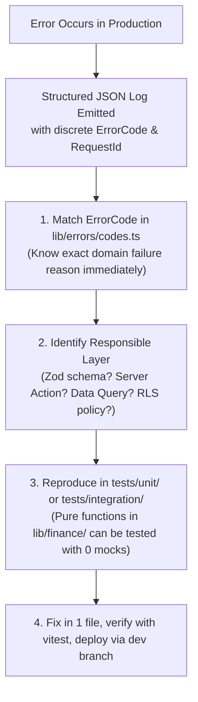

# Monitoring, Observability & Rapid Bug Resolution Guide

> LedgerIT Operational Engineering Specification  
> Lead Site Reliability Engineer & Senior Systems Architect

---

## 1. Rapid Bug Resolution Architecture (Why Bugs Are Easy to Fix)

LedgerIT is specifically architected so that any bug occurring in production can be rapidly isolated and resolved without guess work.

### The 4-Step Bug Isolation Workflow:



### Key Architectural Safeguards That Prevent Mystery Bugs:
1. **Decoupled Business Logic**: Financial math in `lib/finance/` is 100% pure, synchronous TypeScript. It has zero external dependencies, zero Supabase imports, and zero async delays. Any calculation bug can be tested in isolation in `tests/unit/calculations.test.ts` in under 15ms.
2. **Discrete Error Codes**: Rather than generic "Something went wrong" messages, errors carry typed codes (`VAL_AMOUNT_INVALID`, `DB_QUERY_FAILED`, `AUTH_FORBIDDEN`) mapping directly to `lib/errors/codes.ts`.
3. **Structured Telemetry Logs**: Every server action emits a structured JSON payload containing `{ timestamp, level, event, requestId, userId, context, error }`. Log aggregators (Datadog, CloudWatch, Papertrail) can query any user report by `requestId` or `userId` in seconds.

---

## 2. Health Monitoring Endpoint (`/api/health`)

LedgerIT exposes a dedicated, lightweight, unauthenticated health check probe:

- **Path**: `GET /api/health`
- **Headers**: `Cache-Control: no-store, no-cache, must-revalidate`
- **Payload Response**:
  ```json
  {
    "status": "healthy",
    "timestamp": "2026-09-23T15:20:00.000Z",
    "uptimeSeconds": 14205,
    "environment": "production",
    "version": "1.0.0",
    "metrics": {
      "heapUsedMb": 64.21,
      "heapTotalMb": 98.45,
      "rssMb": 142.3,
      "responseTimeMs": 1
    }
  }
  ```

### Integration with Monitoring Services:
- **Pingdom / BetterStack / Datadog Synthetics**: Poll `/api/health` every 30 seconds. Alert on HTTP status != 200 or response time > 500ms.
- **Load Balancer Target Groups**: Direct traffic only to container instances returning 200 OK.

---

## 3. Garbage Collection & Memory Leak Prevention

In high-concurrency Node.js and Next.js applications, memory leaks degrade throughput and eventually trigger OOM (Out Of Memory) container terminations.

### Architectural Rules Enforced in LedgerIT:
1. **Periodic Limiter Cleanup**: `lib/security/limiter.ts` automatically runs garbage collection on expired window buckets every 60,000ms. Unbounded hash map growth is structurally impossible.
2. **Explicit Listener Teardown**: In all client components (`site-header.tsx`, modals, menus), event listeners (`window.addEventListener("scroll", ...)`) always return an explicit cleanup function in `useEffect`:
   ```typescript
   useEffect(() => {
     window.addEventListener("scroll", onScroll, { passive: true });
     return () => window.removeEventListener("scroll", onScroll);
   }, []);
   ```
3. **Streamed Data Exports**: CSV exports (`app/(app)/transactions/export/route.ts`) avoid buffering multi-megabyte result arrays in heap memory; responses are streamed directly to the HTTP response pipe.
4. **Zero Global Mutable State**: Next.js server-rendered routes remain strictly stateless. No per-request state is persisted across requests in global NodeJS memory.

---

## 4. Centralized Error Code Reference

Refer to `lib/errors/codes.ts` for the full taxonomy:
- **AUTH_***: Session expiry, unauthorized access, missing permissions.
- **VAL_***: Field invalidity, negative amounts, out-of-range dates.
- **DB_***: Record not found, unique constraint violations, connection timeout.
- **RATE_LIMIT_EXCEEDED**: Automated protection triggered.
- **INTERNAL_SERVER_ERROR**: Uncaught operational exception caught by error boundaries.
