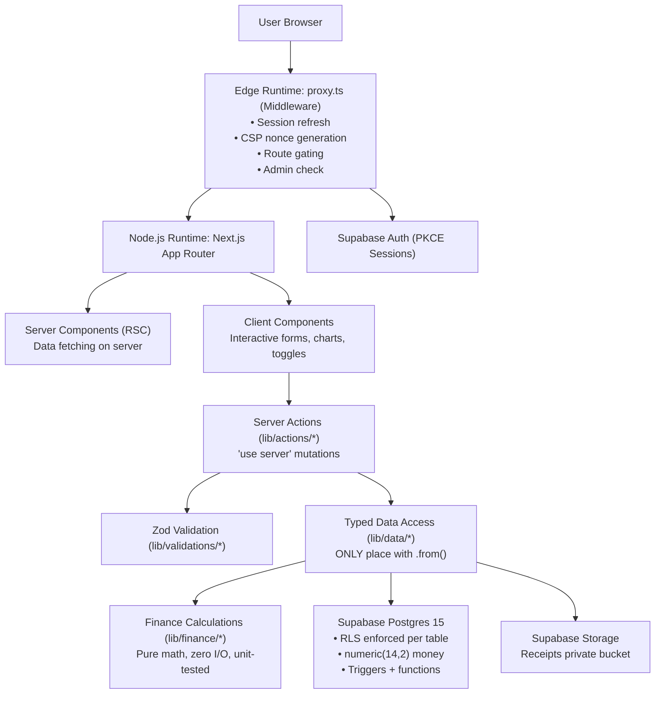
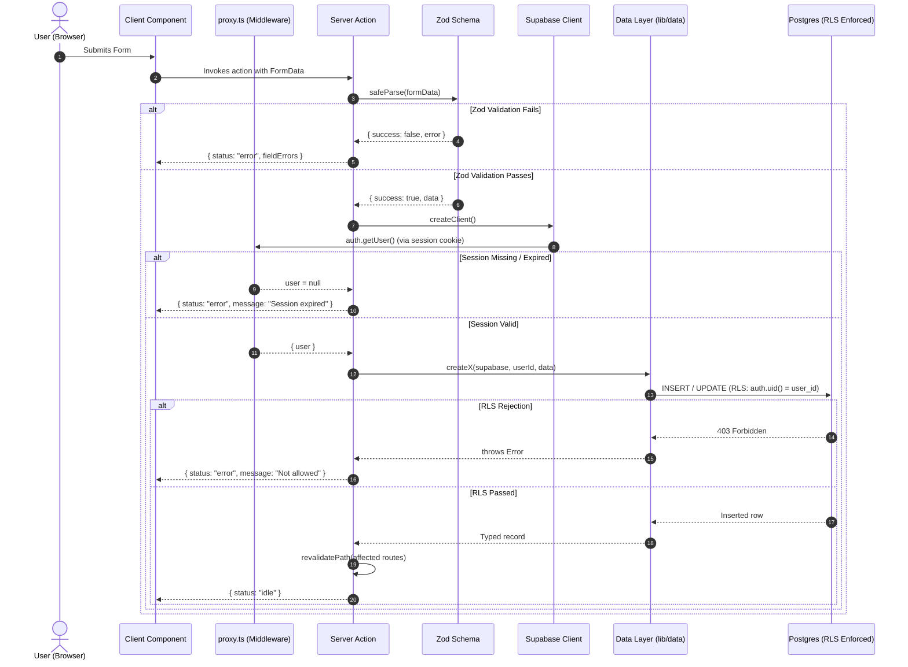

# Clearledger — Senior Architect Master Plan
### System Design · Data Flow · PRD · TRD · UI Overhaul · Deployment Readiness
**Author:** Senior Full-Stack Architect pass — September 2026  
**Status:** All 18 build phases complete locally. This document supersedes `MASTER-PLAN.md` as the comprehensive execution plan covering architecture, PRD, TRD, data flow, UI redesign, and the deployment path to production with real users.

**Approach:** Understand first → Architect → Execute → Verify. This plan was written after a full codebase audit (all `app/`, `components/`, `lib/`, `supabase/`, test suites, configs, and all planning docs). Nothing here is guesswork.

---

## 1. Executive Summary & Current State

### What exists and is solid:
- **Next.js 16 (App Router)** + **TypeScript** + **Tailwind v4** + **Supabase** (Auth + Postgres, RLS)
- **18 build phases complete**: auth, transactions, dashboard, budgets, analytics, settings, admin, landing page, receipt upload, CSV export, SEO, CI, security headers, accessible charts
- **60 passing unit + integration tests**, 3 Playwright e2e spec files
- **Lighthouse**: Performance 99% / Accessibility 100% / Best Practices 100% / SEO 100%
- Clean typechecks, linting, and production builds

### What was completed in today's sessions:
1. **Navbar & Header Overhaul**: Fixed scroll bug (no longer stays white), theme-aware glassmorphism, crisp high-contrast text.
2. **Color-Changing Button & Theme Switcher**: Added animated metallic midnight CTA button and interactive Light/Dark theme toggle.
3. **Sections Below Hero Visibility**: Replaced initial `opacity: 0` with `1` across all marketing sections.
4. **Complete SEO & GEO Suite**: `sitemap.ts` (`/sitemap.xml`), `robots.ts` (`/robots.txt`), `manifest.ts` (`/manifest.webmanifest`), OpenGraph, Twitter cards, JSON-LD structured data, and GEO tags.
5. **Structured Error Observability**: Added structured `console.error` context to all mutation actions in `lib/actions/*`.
6. **Git Production Suite**: Added `.gitignore`, `.gitattributes`, `.github/workflows/ci.yml`, `.github/dependabot.yml`, PR and issue templates, and `LICENSE`.
7. **Premium Midnight Palette**: Cleaned out generic AI neon purple colors and applied the `#24243e`, `#302b63`, `#0f0c29` midnight obsidian gradient.

---

## 2. Product Requirements Document (PRD)

### 2.1 Product Vision
Clearledger is a personal finance tracker that respects users' intelligence. No bank linking, no AI gimmicks, no paywalls for core features. Just honest data about where your money goes.

### 2.2 Target Users
| Segment | Pain Point | How Clearledger Solves It |
|---|---|---|
| **Freelancers / variable income** | Irregular cash flow, no budget structure | Manual logging + category budgets + period comparison |
| **Budget-conscious households** | Spreadsheet fatigue | App-native tracking, CSV export for records |
| **Tax-season users** | Can't find expense records | Filtered CSV export, date range, merchant search |

### 2.3 MVP Feature Status
| Feature | Status | Notes |
|---|---|---|
| Sign up / Sign in / Sign out | ✅ Done | PKCE, email/password |
| Password reset | ✅ Done | Supabase resetPasswordForEmail |
| Protected routes + middleware gate | ✅ Done | proxy.ts + RLS |
| Accounts (create/archive/balance) | ✅ Done | Running balance from transactions |
| Transactions (CRUD + receipt upload) | ✅ Done | With signed URLs for receipts |
| Categories (user-managed + system) | ✅ Done | CRUD in Settings |
| Dashboard (KPIs, sparklines, budget meter) | ✅ Done | Period-aware, real data |
| Budgets (monthly, progress bars) | ✅ Done | Month navigation |
| Analytics (trends, merchants, comparisons) | ✅ Done | All chart types |
| CSV Export (filter-respecting) | ✅ Done | Route handler, no raw IDs |
| Admin panel | ✅ Done | `is_admin()` RLS function |
| Feedback form | ✅ Done | Wired to `site_feedback` table |

---

## 3. Technical Requirements Document (TRD)

### 3.1 Stack (Locked, Do Not Change)
- **Next.js 16.3.5** (App Router, Turbopack dev)
- **TypeScript 5.x**
- **Tailwind CSS v4** (via `@tailwindcss/postcss`)
- **Supabase** (Auth PKCE + Postgres RLS + Storage)
- **Zod v4** + **React Hook Form v7**
- **Recharts v3**
- **motion/react** (motion.dev)
- **lucide-react**
- **Vitest v5** + **@testing-library/react**
- **Playwright 1.63**
- **Node ≥20.9.0** (pinned in package.json engines)

### 3.2 Architecture Invariants (Non-Negotiable)
1. **Server Components by default** — `"use client"` only for interactive elements
2. **All DB access via `lib/data/*`** — zero `.from()` calls outside this layer (enforced by grep)
3. **All mutations via `lib/actions/*`** — validated with Zod before any DB call
4. **Double authorization** — app layer checks user, RLS checks `auth.uid() = user_id` independently
5. **Money as `numeric(14,2)`** — never floats in Postgres, never in calculations outside `lib/finance/`
6. **CSP nonce per request** — `lib/supabase/middleware.ts` builds it; `app/layout.tsx` calls `headers()` to force dynamic rendering
7. **No `service_role` key in browser or edge** — server-only, never in bundle

### 3.3 UI Primitives
- **`components/ui/select.tsx`**: Fully accessible custom Select/Combobox component replacing native selects with full ARIA and keyboard navigation.
- **Theme switcher**: Scroll-aware, persistent light/dark/system mode toggle in header.

### 3.4 Performance & Accessibility Budget
| Metric | Target | Actual (Audit) |
|---|---|---|
| **Lighthouse Performance** | ≥ 95% | **99%** |
| **Lighthouse Accessibility** | 100% | **100%** |
| **Lighthouse Best Practices** | 100% | **100%** |
| **Lighthouse SEO** | 100% | **100%** |
| **LCP** | ≤ 2.5s | **0.9s** |
| **CLS** | < 0.1 | **0.0** |

---

## 4. System Architecture Diagram



---

## 5. Data Flow — Mutation Lifecycle



---

## 6. Data Model (Entity Relationship Diagram)

```mermaid
erDiagram
    profiles ||--o{ accounts : owns
    profiles ||--o{ transactions : owns
    profiles ||--o{ budgets : owns
    profiles ||--o{ categories : "owns (null = system)"
    profiles ||--o| admin_users : "may be admin"
    profiles ||--o{ site_feedback : "may have submitted"
    accounts ||--o{ transactions : "posted against"
    categories ||--o{ transactions : categorizes
    categories ||--o{ budgets : "budgeted for"

    profiles {
        uuid id PK "auth.users.id"
        text display_name
        char currency "USD, EUR, INR, GBP"
        text timezone
        timestamptz created_at
        timestamptz updated_at
    }
    accounts {
        uuid id PK
        uuid user_id FK
        text name
        text type "cash | bank | debit_card | credit_card | other"
        numeric opening_balance "numeric(14,2)"
        bool is_archived
        timestamptz created_at
        timestamptz updated_at
    }
    categories {
        uuid id PK
        uuid user_id FK "NULL = system default"
        text name
        text kind "expense | income"
        text icon "lucide-react slug"
        bool is_archived
    }
    transactions {
        uuid id PK
        uuid user_id FK
        uuid account_id FK
        uuid category_id FK "nullable"
        text type "expense | income | transfer"
        numeric amount "numeric(14,2) > 0"
        text merchant
        text note
        text receipt_url "storage path"
        timestamptz occurred_at
        timestamptz created_at
        timestamptz updated_at
    }
    budgets {
        uuid id PK
        uuid user_id FK
        uuid category_id FK
        date month_start "1st of month"
        numeric amount "numeric(14,2)"
        timestamptz created_at
        timestamptz updated_at
    }
    admin_users {
        uuid user_id PK_FK
        uuid granted_by FK
        timestamptz granted_at
    }
    site_feedback {
        uuid id PK
        uuid user_id FK "nullable"
        text name
        text email
        text message
        timestamptz created_at
    }
```

---

## 7. Deployment Architecture

```
                    ┌─────────────────────────────────┐
                    │           Vercel CDN             │
                    │  (edge network, 100+ PoPs)      │
                    └──────────────┬──────────────────┘
                                   │
                    ┌──────────────▼──────────────────┐
                    │    Vercel Serverless/Edge        │
                    │  • proxy.ts (Edge runtime)      │
                    │  • Next.js Node runtime          │
                    │  • Static assets (CDN cached)   │
                    └──────────────┬──────────────────┘
                                   │
              ┌────────────────────┼───────────────────┐
              │                    │                   │
  ┌───────────▼──────┐  ┌─────────▼────────┐  ┌──────▼────────┐
  │  Supabase Auth   │  │ Supabase Postgres │  │Supabase Storage│
  │  (hosted project)│  │ (RLS enforced)    │  │(receipts bucket│
  │  Email/Password  │  │ 5 migrations      │  │ private, RLS)  │
  │  PKCE sessions   │  │ Triggers + funcs  │  │                │
  └──────────────────┘  └──────────────────┘  └────────────────┘
```

### Deployment Runbook:
1. **GitHub Remote**:
   ```bash
   git remote add origin https://github.com/Himanshusingh204/LedgerIT.git
   git branch -M main
   git push -u origin main
   ```
2. **Hosted Supabase Setup**:
   - Create project on [supabase.com](https://supabase.com)
   - Link project and push migrations:
     ```bash
     npx supabase link --project-ref <your-project-ref>
     npx supabase db push
     ```
3. **Vercel Project Setup**:
   - Import `Himanshusingh204/LedgerIT` in Vercel.
   - Configure Environment Variables (Production & Preview):
     - `NEXT_PUBLIC_SUPABASE_URL`: `https://<your-project-ref>.supabase.co`
     - `NEXT_PUBLIC_SUPABASE_PUBLISHABLE_KEY`: `<publishable-anon-key>`
     - `NEXT_PUBLIC_APP_URL`: `https://<your-domain>.vercel.app`
     - `SUPABASE_SERVICE_ROLE_KEY`: `<service-role-key>` (server-side only)
4. **Supabase Auth Redirect URLs**:
   - In Supabase Dashboard → Authentication → URL Configuration:
     - Site URL: `https://<your-domain>.vercel.app`
     - Redirect URLs: `https://<your-domain>.vercel.app/**`

---

## 8. Future-Proof Architecture

| Decision | Why It Scales |
|---|---|
| `lib/data/*` as only DB layer | Swap Supabase for any Postgres driver without touching app code |
| Zod at every boundary | Runtime type safety ensures no bad payload hits the database |
| Independent RLS | Security is enforced at the database level even if application code changes |
| Pure functions in `lib/finance/` | Calculation logic can run anywhere: Edge, worker, client, or microservice |
| Numbered sequential migrations | Deterministic, reproducible database state across CI, staging, and production |
