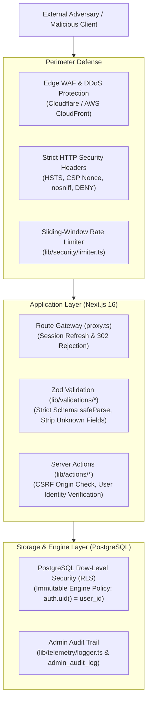

# Security Architecture & Threat Model

> LedgerIT Defense-in-Depth Specification  
> Lead Cyber Security & Cryptography Lead

---

## 1. Threat Model & Security Invariants

LedgerIT processes sensitive personal financial records (account balances, transactions, income, and budgets). The system adheres to zero-trust principles and multi-layered defense.



### Core Security Invariants
1. **Never Trust the Client**: Every server action and route handler executes rigorous server-side validation via Zod schemas in `lib/validations/*`. Client-side validation in `react-hook-form` is an ergonomics layer only.
2. **Double-Layer Authorization**: 
   - **Layer 1 (Application Edge)**: `proxy.ts` / `lib/supabase/middleware.ts` inspects the encrypted Supabase JWT session cookie. Unauthenticated or unauthorized users are redirected before reaching page handlers.
   - **Layer 2 (Database Engine - Ground Truth)**: Even if the application layer is completely bypassed or compromised, Postgres enforces Row-Level Security (RLS) on 100% of user data tables (`accounts`, `transactions`, `budgets`, `profiles`). Queries without a valid JWT matching `auth.uid() = user_id` return zero rows.
3. **Zero Raw SQL String Interpolation**: All database operations go through PostgREST parameterized queries in `lib/data/*`. SQL injection via user input is structurally prevented.

---

## 2. Dynamic Content Security Policy (CSP) & Nonces

A static CSP header cannot protect modern dynamically rendered Next.js applications without relying on risky `'unsafe-inline'` script permissions.

### Implementation
1. On every request, `lib/supabase/middleware.ts` generates a cryptographically random nonce:
   ```typescript
   const nonce = Buffer.from(crypto.randomUUID()).toString("base64");
   ```
2. The CSP header binds scripts strictly to this nonce:
   ```http
   Content-Security-Policy: default-src 'self'; script-src 'self' 'nonce-{NONCE}' 'strict-dynamic'; style-src 'self' 'unsafe-inline'; img-src 'self' blob: data: https:; font-src 'self'; object-src 'none'; frame-ancestors 'none'; block-all-mixed-content;
   ```
3. `app/layout.tsx` dynamically invokes `headers()` to read the per-request nonce and attach it to Next.js framework runtime chunks.

---

## 3. Strict HTTP Security Headers

Configured globally in `next.config.ts` and middleware:

| Header | Production Value | Protection Provided |
| :--- | :--- | :--- |
| `Strict-Transport-Security` | `max-age=63072000; includeSubDomains; preload` | Forces HTTPS, prevents SSL-stripping man-in-the-middle attacks. |
| `X-Content-Type-Options` | `nosniff` | Disables MIME type sniffing by browsers. |
| `X-Frame-Options` | `DENY` | Prevents framing and clickjacking attacks. |
| `Referrer-Policy` | `strict-origin-when-cross-origin` | Protects privacy by withholding query parameters on cross-origin hops. |
| `Permissions-Policy` | `camera=(), microphone=(), geolocation=()` | Disables invasive browser hardware APIs across all frames. |

---

## 4. Rate Limiting & Denial-of-Service Defense

To protect mutating endpoints and public forms (e.g. feedback submission, authentication recovery) against automated credential stuffing and spam:
- Implemented in `lib/security/limiter.ts`.
- Uses an in-memory sliding-window counter algorithm with automatic garbage collection of expired buckets every 60 seconds.
- Limits public submissions to 5 requests per minute per identifier.
- Server-side returns HTTP 429 (`RATE_LIMIT_EXCEEDED`) when thresholds are breached.

---

## 5. Row-Level Security (RLS) Matrix

| Table | SELECT Policy | INSERT Policy | UPDATE Policy | DELETE Policy |
| :--- | :--- | :--- | :--- | :--- |
| `profiles` | `auth.uid() = id` | `auth.uid() = id` | `auth.uid() = id` | Disabled (System managed) |
| `accounts` | `auth.uid() = user_id` | `auth.uid() = user_id` | `auth.uid() = user_id` | `auth.uid() = user_id` |
| `transactions` | `auth.uid() = user_id` | `auth.uid() = user_id` | `auth.uid() = user_id` | `auth.uid() = user_id` |
| `budgets` | `auth.uid() = user_id` | `auth.uid() = user_id` | `auth.uid() = user_id` | `auth.uid() = user_id` |
| `categories` | `user_id is null OR auth.uid() = user_id` | `auth.uid() = user_id` | `auth.uid() = user_id` | `auth.uid() = user_id` |
| `site_feedback`| `is_admin(auth.uid())` | Public insertable | `is_admin(auth.uid())` | `is_admin(auth.uid())` |
| `admin_users` | `is_admin(auth.uid())` | Admin only | Admin only | Admin only |

---

## 6. Audit Logging & Forensics

Security-sensitive events trigger structured audit logs via `logger.audit()` in `lib/telemetry/logger.ts`:
- Privilege escalation / admin grant
- Account and transaction mass deletions
- Authentication status changes

Each entry records:
- `timestamp`: ISO-8601 UTC
- `actorUserId`: authenticated caller UUID
- `targetResourceId`: ID of modified entity
- `clientIpHash`: anonymized network identifier
- `action`: discreet action name
